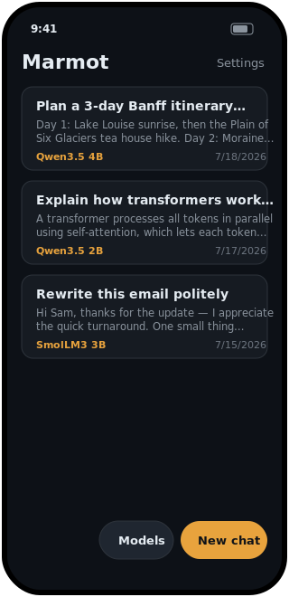
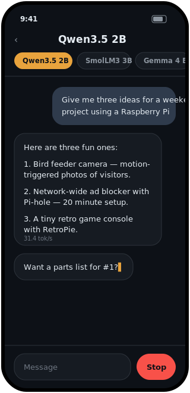
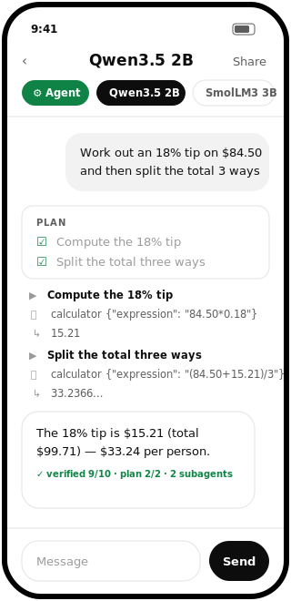
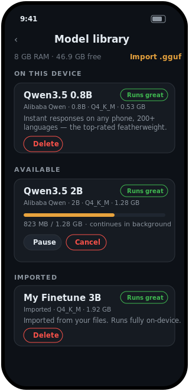
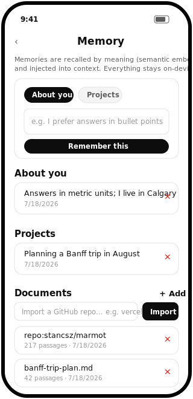
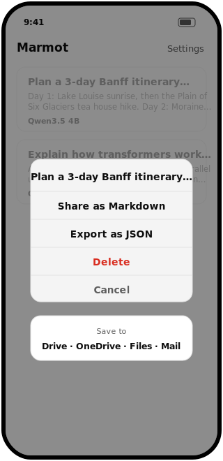
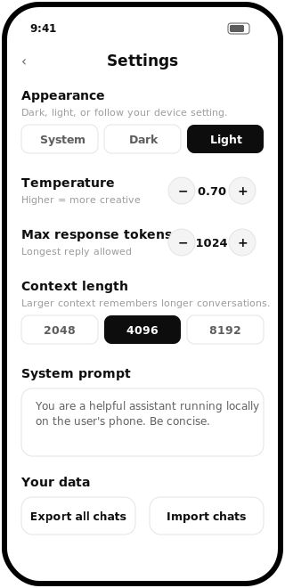

<p align="center">
  
</p>

<h3 align="center">Marmot</h3>

<p align="center">
  <b>Ollama for your phone.</b><br/>
  Download small open models. Chat with them entirely on-device.<br/>
  No account, no cloud, no telemetry — works in airplane mode.
</p>

<p align="center">
  <a href="LICENSE"></a>
  
  
  <a href="#contributing"></a>
</p>

---

## What is Marmot?

Marmot is a lightweight iOS + Android app that does for phones what
[Ollama](https://ollama.com) does for laptops: pick a model from a curated
library, download it once, and chat with it locally. Inference runs on your
device with [llama.cpp](https://github.com/ggml-org/llama.cpp) — Metal-accelerated
on iOS, ARM-optimized CPU on Android.

Instead of exposing thousands of models, Marmot ships **one champion per
weight class** — the highest-rated open model at each size a phone can run,
as of July 2026 — each with a RAM-fit badge computed from your device's
actual memory so you know before downloading whether it will run comfortably.

## Screens

| Home | Chat | Agent mode |
| :---: | :---: | :---: |
|  |  |  |

| Model library | Memory | Export | Settings (light) |
| :---: | :---: | :---: | :---: |
|  |  |  |  |

## Features

- 🔒 **Fully private** — the only network traffic is the one-time model
  download from Hugging Face. Chats never leave the device.
- ⚡ **Streaming responses** with per-reply tokens/sec stats, rendered as
  markdown (bold, lists, code blocks, links) in assistant bubbles.
- 📦 **Resumable downloads** that continue in the background (iOS background
  session) and survive app restarts — pause, resume, cancel, delete. A
  `.gguf` on disk is always complete (downloads write to a `.part` file and
  move atomically).
- 🧠 **RAM-fit badges** — "Runs great / Should run / May be too big" based on
  your device's total memory vs. model size.
- 🤔 **Reasoning-model aware** — Qwen3.5 and SmolLM3's `<think>…</think>`
  blocks are folded into a "Thinking…" indicator instead of leaking raw tags
  into the chat.
- 🎛️ **Tunable sampling** — temperature, top-p, max tokens, context length
  (2k/4k/8k), and a custom system prompt.
- 🌗 **Light & dark mode** — dark by default, with light and follow-system
  options in Settings.
- 🤖 **Agent Mode** — flip the ⚙ Agent chip and the model works step-by-step
  with local tools (calculator, clock, chat search), showing a live
  thought/tool/observation timeline. Multi-step tasks are orchestrated:
  a planner decomposes the task, each step runs in a fresh executor with
  its own budget, steps check off live, and a synthesizer (plus optional
  judge gate) produces the final answer. Policy-bounded, fully on-device,
  unit-tested core ([docs/AGENT.md](docs/AGENT.md)).
- ⚖️ **Verified answers (optional)** — a Settings toggle runs a
  reflection pass (which may revise the answer) plus an independent judge
  pass after each agent reply, stamping a ✓/⚠ score badge on the message.
- 🧠 **Memory** — the agent remembers facts about you and your projects
  (viewable and editable in Settings → Memory) and auto-captures one-line
  summaries of past exchanges. Recall is semantic: memories are matched by
  meaning using on-device embeddings from the loaded model, with keyword
  fallback when no model is running.
- 📤 **Export, import & share** — share a chat as Markdown or back up
  everything as JSON through the native share sheet (Google Drive, OneDrive,
  Files, email — no cloud SDKs, no OAuth, Marmot never holds a credential),
  and restore backups with a merge that never overwrites newer local chats.
- 🪶 **Lightweight** — ~2 MB JS bundle, no backend, one model in memory at a
  time (switching models releases the previous context first).

## Model catalog

| Class | Model | Download | Runs on | Why it's the pick |
| --- | --- | --- | --- | --- |
| 🪶 Featherweight | Qwen3.5 0.8B | 0.53 GB | any phone | Rated far above every other sub-1B; 200+ languages |
| 🥊 Lightweight | Qwen3.5 2B | 1.28 GB | 4–6 GB RAM | Beats Gemma 4 E2B on reasoning, GPQA, intelligence |
| 🥋 Middleweight | SmolLM3 3B | 1.92 GB | 6 GB RAM | Strongest fully-open 3B, dual-mode reasoning |
| 🏋️ Cruiserweight | Qwen3.5 4B | 2.74 GB | 8 GB RAM | Strongest dense 4B: knowledge, science, agentic wins |
| 👑 Heavyweight | Gemma 4 E4B | 4.06 GB | 12 GB+ RAM | 8B weights at a 4B footprint; closest to cloud quality |

All Apache 2.0. Q4_K_M GGUF builds (Gemma 4 E4B ships as Q3_K_M to stay
phone-sized) from [unsloth](https://huggingface.co/unsloth), with URLs and
exact byte sizes verified against the hosted files. Rankings from
[Artificial Analysis](https://artificialanalysis.ai) and per-tier benchmark
comparisons; re-evaluated as new models ship. Beyond the catalog, any local
`.gguf` can be imported from the Files app ("Import .gguf" in the model
library) and used as a first-class model.

## Getting started

Marmot uses native modules, so it needs a development build (not Expo Go).

**Prerequisites:** Node 20+, and Android Studio (Android) or Xcode on macOS (iOS).

```bash
git clone https://github.com/meowju/marmot.git
cd marmot
npm install

npx expo run:android   # Android
npx expo run:ios       # iOS (macOS only)
```

`expo run` generates the native `android/` and `ios/` projects automatically
(continuous native generation) — they are disposable and not checked in.

> **Windows note:** if llama.rn's postinstall fails with a tar error under Git
> Bash, rerun it with Windows' native tar:
> `PATH="/c/Windows/System32:$PATH" node node_modules/llama.rn/install/download-native-artifacts.js`

## Architecture

```
src/
  models/catalog.ts      # curated model list (id, URL, exact size, license)
  lib/
    engine.ts            # single global llama.cpp context; load/unload/stream
    downloads.ts         # resumable downloads → .part file → atomic move
    chatStore.ts         # AsyncStorage persistence for chats + settings
    exportShare.ts       # Markdown/JSON export via the OS share sheet
  agent/                 # pure-TS agent core (loop, tools, planner, memory,
                         # skills, policies, reflection, judge) — unit-tested,
                         # UI wiring in progress; see docs/AGENT.md
    deviceMemory.ts      # RAM-fit heuristic (total RAM vs model size)
    thinking.ts          # <think>…</think> splitter for reasoning models
  screens/
    ChatListScreen.tsx   # home: conversation history
    ChatScreen.tsx       # streaming chat + model picker strip
    ModelsScreen.tsx     # library: download/pause/resume/delete + fit badges
    SettingsScreen.tsx   # sampling params, context length, system prompt
```

**Stack:** React Native (Expo SDK 57) · [llama.rn](https://github.com/mybigday/llama.rn) · TypeScript.

## Adding a model to the catalog

One entry in [`src/models/catalog.ts`](src/models/catalog.ts):

```ts
{
  id: 'my-model-1b',
  name: 'My Model 1B',
  family: 'Vendor',
  params: '1B',
  quant: 'Q4_K_M',
  sizeBytes: 807_694_464,        // exact — verify with: curl -sIL <url> | grep -i content-length
  url: 'https://huggingface.co/…/resolve/main/….gguf',
  description: 'One or two sentences on what it is good at.',
  license: 'Apache 2.0',
  thinking: false,               // true if it emits <think> blocks
}
```

Catalog PRs are welcome, with two constraints: the model must run acceptably
on a mid-range phone (≤ ~2.5 GB quantized), and the size must be the exact
byte count of the hosted file — the download manager and RAM-fit badges
depend on it.

## Roadmap

- [x] Markdown rendering in chat bubbles
- [x] Import chats back from a JSON export
- [x] Import any local `.gguf` from the Files app
- [x] Background downloads
- [ ] Android GPU (OpenCL/Vulkan) inference where supported
- [ ] Prompt templates / saved personas
- [ ] Basic RAG over local documents

## Contributing

Issues and PRs are welcome. For anything non-trivial, open an issue first so
we can agree on the approach. To hack on the app:

```bash
npm install
npx tsc --noEmit     # typecheck
npx expo run:android # run on a device/emulator
```

Please keep the project's constraints in mind: no backend services, no
analytics, no accounts — Marmot stays local-only by design.

## Acknowledgements

- [llama.cpp](https://github.com/ggml-org/llama.cpp) — the inference engine
- [llama.rn](https://github.com/mybigday/llama.rn) — llama.cpp bindings for React Native
- [unsloth](https://huggingface.co/unsloth) and
  [bartowski](https://huggingface.co/bartowski) — the quantized GGUF builds
- Meta, Google, Alibaba, and Hugging Face for the open models

## License

[MIT](LICENSE) — the app. Each model has its own license (shown in the
catalog and in-app) that you accept by downloading it.
