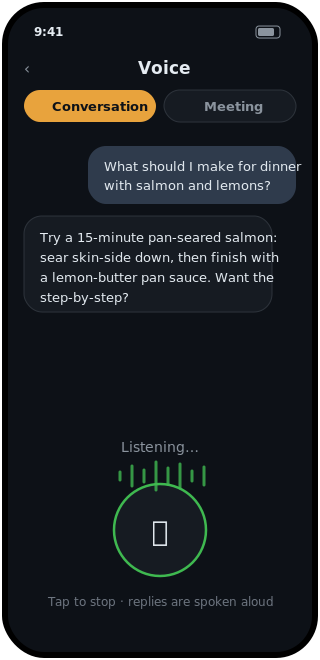
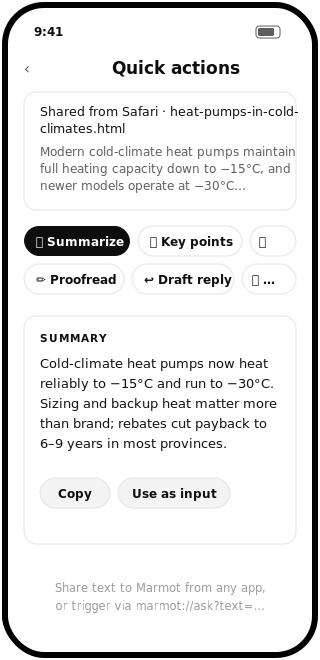

<p align="center">
  
</p>

<h3 align="center">Marmot</h3>

<p align="center">
  <b>Ollama for your phone.</b><br/>
  Download small open models. Chat with them entirely on-device.<br/>
  No account, no cloud, no telemetry — works in airplane mode.
</p>

<p align="center">
  <a href="https://super-marmot.github.io"><b>super-marmot.github.io</b></a>
</p>

<p align="center">
  <a href="https://github.com/stancsz/marmot/actions/workflows/ci.yml"></a>
  <a href="LICENSE"></a>
  
  
  <a href="#contributing"></a>
</p>

---

## What is Marmot?

Marmot is a lightweight iOS + Android app that does for phones what
[Ollama](https://ollama.com) does for laptops: pick a model from a curated
library, download it once, and chat with it locally. Inference runs on your
device with [llama.cpp](https://github.com/ggml-org/llama.cpp) — Metal-accelerated
on iOS, ARM-optimized CPU on Android.

Instead of exposing thousands of models, Marmot ships **one champion per
weight class** — the highest-rated open model at each size a phone can run,
as of July 2026 — each with a RAM-fit badge computed from your device's
actual memory so you know before downloading whether it will run comfortably.

## Screens

| Home | Chat | Agent mode |
| :---: | :---: | :---: |
|  |  |  |

| Voice mode | Quick actions | Memory & RAG |
| :---: | :---: | :---: |
|  |  |  |

| Model library | Export | Settings |
| :---: | :---: | :---: |
|  |  |  |

## Features

**Chat**

- ⚡ **Streaming replies** with tok/s stats, rendered as markdown (bold,
  lists, code blocks, tappable links) in assistant bubbles.
- 🤔 **Reasoning-model aware** — `<think>…</think>` blocks fold into a
  "Thinking…" indicator instead of leaking raw tags.
- 🎭 **Personas** — five built-ins (Concise, Coach, Writer, Tutor, Developer)
  plus save-your-own; the active persona shapes chat and agent answers alike.
- 🎛️ **Tunable sampling** — temperature, top-p, max tokens, context length,
  system prompt; 🌗 light by default, with dark and follow-system themes.

**Agent**

- 🤖 **Agent Mode** — flip the ⚙ chip and the model works step-by-step with
  local tools (calculator, clock, chat search, document search), showing a
  live thought/tool/observation timeline. Multi-step tasks are orchestrated:
  a planner decomposes, fresh-context executors run each step, live ☑
  check-offs, then a synthesizer produces the answer
  ([docs/AGENT.md](docs/AGENT.md)).
- ⚖️ **Verified answers (optional)** — a reflection pass may revise, an
  independent judge scores; the verdict badge persists on the message.
- 🧠 **Memory** — user/project facts (editable in Settings → Memory) plus
  auto-captured episode summaries, recalled *by meaning* with on-device
  embeddings and injected into agent runs.
- 📚 **Document & repo RAG** — import text/markdown files or a public GitHub
  repo (`owner/repo`) and chat with them via semantic search, fully
  on-device.
- 🌐 **Web research (opt-in)** — `web_search` + `fetch_page` tools with cited
  sources; with the switch off, Marmot is provably offline.
- 🔌 **MCP client** — connect Model Context Protocol servers over HTTP
  (home server, Home Assistant, work tools); their tools appear in Agent
  Mode, namespaced per server, gated by the same policy layer.

**Everyday**

- ⚡ **Share-to-Marmot** — share text or a page from any app (or paste) and
  hit one-tap actions: summarize, key points, proofread, translate, change
  tone, draft a reply, explain, or save into searchable documents.
- 🔬 **Deep research** — with web access on, a Research toggle steers the
  agent into multi-angle searches, source fetches, and a cited report.
- 🔗 **Automation hooks** — `marmot://ask?text=…` deep link for iOS
  Shortcuts and Android automation.

**Voice**

- 🎙️ **Conversation mode** — a hands-free listen → think → speak loop with
  an animated, phase-aware voice stage.
- 📝 **Meeting mode** — continuous transcription with a recording timer;
  say "Marmot, …" for a suggested contribution (tap-to-speak card — it never
  talks into the room uninvited); transcripts save into searchable documents.

**Models & data**

- 📦 **Resumable downloads** that continue in the background and survive
  restarts; a `.gguf` on disk is always complete (atomic `.part` moves).
- 📱 **RAM-fit badges** ("Runs great / Should run / May be too big") from
  your device's actual memory; import any local `.gguf` as a first-class
  model; experimental Android GPU toggle.
- 📤 **Export, import & share** — Markdown chat sharing and JSON backups via
  the OS share sheet (Drive, OneDrive, Files — no cloud SDKs, no OAuth);
  restores merge without ever overwriting newer local history.
- 🔒 **Private by architecture** — no account, no backend, no telemetry;
  ~2 MB JS bundle; one model in memory at a time. Capability designs for
  what's next live in [docs/CAPABILITIES.md](docs/CAPABILITIES.md).

## Model catalog

| Class | Model | Download | Runs on | Why it's the pick |
| --- | --- | --- | --- | --- |
| 🪶 Featherweight | Qwen3.5 0.8B | 0.53 GB | any phone | Rated far above every other sub-1B; 200+ languages |
| 🥊 Lightweight | Qwen3.5 2B | 1.28 GB | 4–6 GB RAM | Beats Gemma 4 E2B on reasoning, GPQA, intelligence |
| 🥋 Middleweight | SmolLM3 3B | 1.92 GB | 6 GB RAM | Strongest fully-open 3B, dual-mode reasoning |
| 🏋️ Cruiserweight | Qwen3.5 4B | 2.74 GB | 8 GB RAM | Strongest dense 4B: knowledge, science, agentic wins |
| 👑 Heavyweight | Gemma 4 E4B | 4.06 GB | 12 GB+ RAM | 8B weights at a 4B footprint; closest to cloud quality |

All Apache 2.0. Q4_K_M GGUF builds (Gemma 4 E4B ships as Q3_K_M to stay
phone-sized) from [unsloth](https://huggingface.co/unsloth), with URLs and
exact byte sizes verified against the hosted files. Rankings from
[Artificial Analysis](https://artificialanalysis.ai) and per-tier benchmark
comparisons; re-evaluated as new models ship. Beyond the catalog, any local
`.gguf` can be imported from the Files app ("Import .gguf" in the model
library) and used as a first-class model.

## Getting started

Marmot uses native modules, so it needs a development build (not Expo Go).

**Prerequisites:** Node 20+, and Android Studio (Android) or Xcode on macOS (iOS).

```bash
git clone https://github.com/stancsz/marmot.git
cd marmot
npm install

npx expo run:android   # Android
npx expo run:ios       # iOS (macOS only)
```

`expo run` generates the native `android/` and `ios/` projects automatically
(continuous native generation) — they are disposable and not checked in.

> **Windows note:** if llama.rn's postinstall fails with a tar error under Git
> Bash, rerun it with Windows' native tar:
> `PATH="/c/Windows/System32:$PATH" node node_modules/llama.rn/install/download-native-artifacts.js`

## Architecture

```
src/
  models/catalog.ts       # curated model list (id, URL, exact size, license)
  agent/                  # pure-TS agent core — fully unit-tested
    loop.ts               #   Observe→Decide→Act→Verify + JSON tool protocol
    orchestrator.ts       #   per-step subagent executors + judge gate
    planner.ts  skills.ts #   task decomposition; trigger→procedure registry
    memory.ts  documents.ts  semantic.ts   # memory + RAG, cosine retrieval
    tools.ts  web.ts      #   calculator/clock/search + opt-in web tools
    reflection.ts  verify.ts               # self-critique + judge scoring
  lib/
    engine.ts             # llama.cpp context lifecycle, embeddings, GPU opts
    agentRuntime.ts       # wires the agent core to the engine + stores
    downloads.ts          # resumable background downloads, atomic moves
    chatStore.ts  importParse.ts  exportShare.ts   # persistence + backup
    customModels.ts  repoCore.ts  repoImport.ts    # .gguf + GitHub imports
    voiceSession.ts       # voice-mode state machine (tested)
    markdown.ts  personas… thinking…  deviceMemory…
  screens/                # ChatList, Chat, Models, Memory, Voice, Settings
```

**Stack:** React Native (Expo SDK 57) · [llama.rn](https://github.com/mybigday/llama.rn) · TypeScript.

## Adding a model to the catalog

One entry in [`src/models/catalog.ts`](src/models/catalog.ts):

```ts
{
  id: 'my-model-1b',
  name: 'My Model 1B',
  family: 'Vendor',
  params: '1B',
  quant: 'Q4_K_M',
  sizeBytes: 807_694_464,        // exact — verify with: curl -sIL <url> | grep -i content-length
  url: 'https://huggingface.co/…/resolve/main/….gguf',
  description: 'One or two sentences on what it is good at.',
  license: 'Apache 2.0',
  thinking: false,               // true if it emits <think> blocks
}
```

Catalog PRs are welcome, with two constraints: the model must run acceptably
on a phone (≤ ~4 GB quantized), and the size must be the exact byte count of
the hosted file — the download manager and RAM-fit badges depend on it.

## What's next

The mechanisms are already designed in
[docs/CAPABILITIES.md](docs/CAPABILITIES.md):

- [ ] whisper.rn ASR (offline meeting-grade transcription) + background audio
- [ ] Phone file organization (Android SAF, plan → approve → apply with undo)
- [ ] True git via isomorphic-git; neural TTS; speaker diarization
- [ ] On-device E2E benchmark results (needs real hardware)

## Contributing

Issues and PRs are welcome. For anything non-trivial, open an issue first so
we can agree on the approach. To hack on the app:

```bash
npm install
npx tsc --noEmit     # typecheck
npx expo run:android # run on a device/emulator
```

Please keep the project's constraints in mind: no backend services, no
analytics, no accounts — Marmot stays local-only by design.

## Acknowledgements

- [llama.cpp](https://github.com/ggml-org/llama.cpp) — the inference engine
- [llama.rn](https://github.com/mybigday/llama.rn) — llama.cpp bindings for React Native
- [unsloth](https://huggingface.co/unsloth) and
  [bartowski](https://huggingface.co/bartowski) — the quantized GGUF builds
- Meta, Google, Alibaba, and Hugging Face for the open models

## License

[MIT](LICENSE) — the app. Each model has its own license (shown in the
catalog and in-app) that you accept by downloading it.
